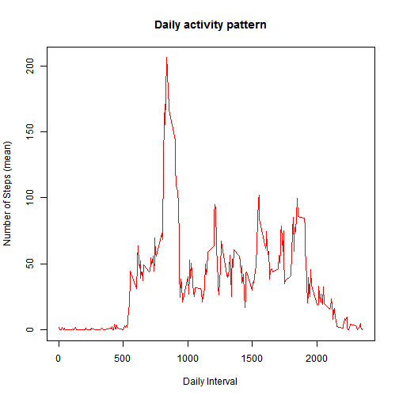
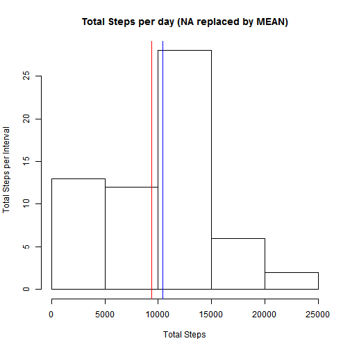
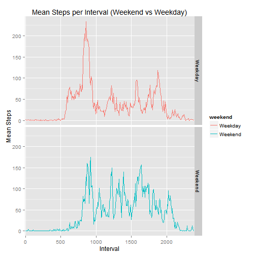

---
title: "Reproducible Research: Peer Assessment 1"
author: Scott Trimber
output: 
  html_document:
    keep_md: true
---

```r
require(knitr)
opts_chunk$set(echo = TRUE, cache = TRUE, cache.path = "cache/", fig.path = "figure/")
```

## Loading and preprocessing the data
Here, we are loading the original source data and displaying a summary view of the raw data.

```r
library(dplyr)
library(lubridate)
library(ggplot2)
library(qdap)
activity <- read.csv("~/Coursera Files/ReproducibleResearch/activity.csv")
activity <- transform(activity, date = factor(date))
summary(activity)
```

```
##      steps                date          interval     
##  Min.   :  0.00   2012-10-01:  288   Min.   :   0.0  
##  1st Qu.:  0.00   2012-10-02:  288   1st Qu.: 588.8  
##  Median :  0.00   2012-10-03:  288   Median :1177.5  
##  Mean   : 37.38   2012-10-04:  288   Mean   :1177.5  
##  3rd Qu.: 12.00   2012-10-05:  288   3rd Qu.:1766.2  
##  Max.   :806.00   2012-10-06:  288   Max.   :2355.0  
##  NA's   :2304     (Other)   :15840
```

## What is mean total number of steps taken per day?
Here, we see a histogram of the Total Steps Per Day activity plotted.  


```r
totalStepsPerDay <- tapply(activity$steps, activity$date, sum)
stepMean <- mean(totalStepsPerDay, na.rm=TRUE)
stepMedian <- median(totalStepsPerDay, na.rm=TRUE)
hist(totalStepsPerDay,main="Total Steps Per Day", xlab="Total Steps", ylab = "Frequency")
```

 


The mean value is **10766.19** and the median value is **10765**. 

## What is the average daily activity pattern?

```r
activity <- transform(activity,interval = factor(interval))
activity <- group_by(activity,interval)
meanStepsPerInterval <- summarise(activity, steps = mean(steps,na.rm=TRUE))
maximumMeanStepsPerInterval <- max(meanStepsPerInterval$steps)
maximumInterval <- meanStepsPerInterval[which.max(meanStepsPerInterval$steps),1]
 plot(levels(as.factor(meanStepsPerInterval$interval)), meanStepsPerInterval$steps, 
      type="l", col="red", 
      main="Daily activity pattern", 
      xlab="Daily Interval", ylab="Number of Steps (mean)")
```

 

The maximum mean steps value is **206.1698** and the interval for that is **835**. 
Imputing missing values. For this situation, we are going to lookup the mean() value for the interval (across all days) and replace the NA with it's mean.  Here, we are replacing NAs with the mean Steps Per Interval value (as stored in the meanStepsPerInterval table).

## Imputing missing values

```r
 #reset the dataset 
activityCleaned <- activity
missingData <- sum(is.na(activityCleaned))
# loop through missing data and replace NA with the mean value for that interval.
# for each NA value, look up the matching "mean" for that interval and replace.
# although this uses a loop, with a bit more research I could come up with a cleaner (i.e. package based) 
# solution to perform the NA replace.

index<-1
for (index in 1:dim(activityCleaned)[1]) # for each row in activityCleaned
  {
    if (is.na(activityCleaned[index,1])) # check if steps value is NA
      {
      # find matching interval in meanStepsPerInterval
        row<-match(activityCleaned[index,3],meanStepsPerInterval$interval)
        activityCleaned[index,1]<-meanStepsPerInterval[row,2]
    }
    index=index+1
}
activityCleaned <- transform(activityCleaned,interval = factor(interval))
activityCleaned <- group_by(activityCleaned,interval)
stepsPerDay2 <- tapply(activityCleaned$steps, activityCleaned$date, sum, na.rm = TRUE)
stepMean2 <- mean(stepsPerDay2, na.rm=TRUE)
stepMedian2 <- median(stepsPerDay2, na.rm=TRUE)
hist(stepsPerDay2,xlab="Total Steps", ylab = "Total Steps per Interval",main="Total Steps per day (NA replaced by MEAN)")
abline(v=stepMean2, col = "red")
abline(v=stepMedian2, col = "blue")
```

 

There were 2304 records with "NA".  The mean value (red line on graph) is **9356.261** and the median value (blue line on graph) is **10395**. You can see from the chart that the replacing the NA interval values with thier mean skewed the earlier intervals to higher values.  

## Are there differences in activity patterns between weekdays and weekends?

It would appear from the charts below that the activity level tends to be higher on the weekends vs weekdays.  


```r
activityCleaned$weekend = chron::is.weekend(as.Date(activityCleaned$date))
activityCleaned$weekend[activityCleaned$weekend == TRUE] <- "Weekend"
activityCleaned$weekend[activityCleaned$weekend == FALSE] <- "Weekday"

plot_data <- activityCleaned %>% group_by(weekend, interval)  %>% summarize(steps = mean(steps, na.rm=TRUE))
plotTitle = "Mean Steps per Interval (Weekend vs Weekday)"
plotYLab = "Mean Steps"
plotXLab = "Interval"

plot <- ggplot(plot_data, aes(x=interval,y=steps,group=weekend)) + geom_line(aes(color=weekend)) + facet_grid(weekend ~ .) + labs(x=plotXLab, y=plotYLab, title=plotTitle) + scale_x_discrete(breaks=seq(0,3000,500))
print(plot)
```

 

